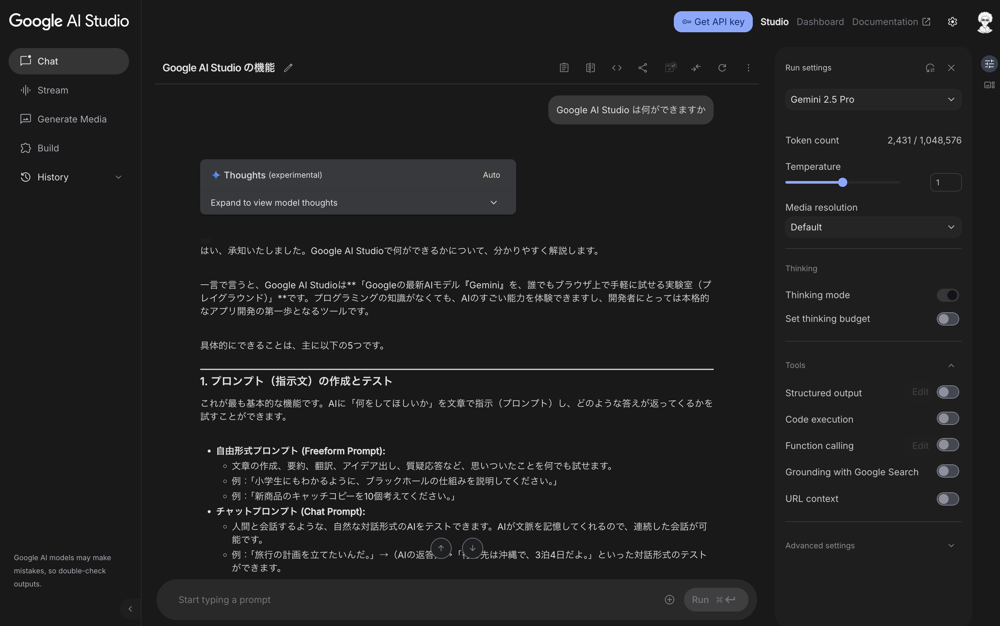
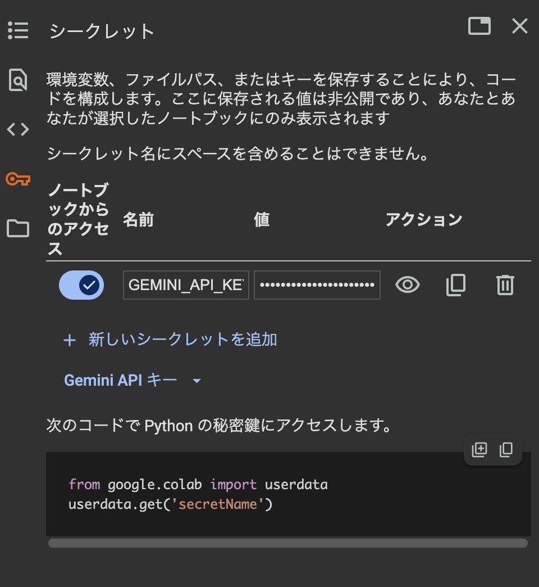
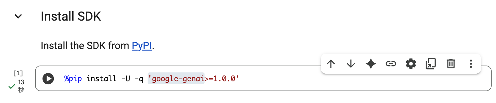

[](https://colab.research.google.com/github/kkitase/gemini-2.5-findy/blob/main/notebooks/00-jp-setup-and-authentication.ipynb)

# パート 1: セットアップと認証

## 0. Google AI Studio 

[Google AI Studio](https://aistudio.google.com/) は、Google の Gemini モデルを素早く試すことができる開発者向けプラットフォームです。使いやすいインターフェースでプロンプトの作成やテスト、モデルのパラメータ調整を行い、そのコードを簡単にエクスポートしてご自身のアプリケーションに組み込むことができます。SDK を使って本格的なコーディングを始める前に、Google の AI モデルの能力を試したり、プロトタイプを作成したりするのに最適なツールです。このワークショップでは、API キーを取得するために `Google AI Studio` を使用します。


## １. Gemini API キーを入手し、Google Colab に設定する

まずは、Gemini API キーを入手し、Google Colab に設定します。

1.  **Google AI Studio にアクセス**: ウェブブラウザで [Google AI Studio](https://aistudio.google.com/apikey) にアクセスします。
2.  **API キーの取得**: 画面の指示に従って、新しい API キーを作成します。このキーは、アプリケーションから Gemini を呼び出すための「鍵」の役割を果たします。大切に保管してください。
3.  Google Colab で左のパネルから、シークレットタブ（🔑）を開きます。

4.  `GEMINI_API_KEY` という名前で、新しいシークレットキーを作成します。
5.  `GEMINI_API_KEY` の「値 (Value)」入力欄に、先ほど作成した Gemini API キーをコピーして貼り付けます。
6.  左側にあるトグルボタンをオンに切り替えて、すべてのノートブックがこのシークレットにアクセスできるように許可します。

## 2. SDK をインストールする

次に、Google Colab の環境に Google の Generative AI SDK をインストールします。Google Colab の環境で以下のコマンドを実行するだけです。（すでにコマンドは記載されているので、実行ボタンを押すだけです。）

```python
%pip install -U -q 'google-genai>=1.0.0'
```


## 3. クライアントの設定と生成のテスト

```python
from google import genai
import sys
import os

# Colab 環境で実行されているかどうかの判定
IN_COLAB = 'google.colab' in sys.modules

if IN_COLAB:
    from google.colab import userdata
    # Colab のシークレットから API キーを取得
    GEMINI_API_KEY = userdata.get('GEMINI_API_KEY')
else:
    # 環境変数から API キーを取得
    GEMINI_API_KEY = os.environ.get('GEMINI_API_KEY', None)

# API キーを使ってクライアントを作成
client = genai.Client(api_key=GEMINI_API_KEY)

# 生成をテスト
response = client.models.generate_content(
    model="gemini-2.5-flash",
    contents="Hello, world!"
)
print(response.text)
```

## 4. 利用可能なモデル

`Gemini API` は、さまざまなニーズに応える強力なモデルを複数提供しています。API を呼び出す際には、使用したいモデルを固有の ID で指定します。利用可能なモデルとその機能に関する最新情報は、いつでも [Google AI の公式ドキュメント](https://ai.google.dev/gemini-api/docs/models)で確認できます。

| モデル名 | モデル ID (例) |
| :--- | :--- |
| Gemini 2.5 Flash Lite | `gemini-2.5-flash-lite` |
| Gemini 2.5 Flash | `gemini-2.5-flash` |
| Gemini 2.5 Pro | `gemini-2.5-pro` |

## まとめと次のステップ

**このパートで学んだこと:**
- `Google AI Studio` を開発の実験場としてセットアップする方法
- `Gemini API` キーを取得し、安全に管理する方法
- `google-genai` Python SDK をインストールし、設定する方法
- 接続をテストするための最初の API 呼び出し
- 利用可能な `Gemini` モデルとその機能についての理解

**関連リソース:**
- [Gemini API ドキュメント クイックスタート](https://ai.google.dev/gemini-api/docs/quickstart?lang=python&hl=ja)
- [利用可能なモデルの概要](https://ai.google.dev/gemini-api/docs/models)
- [Google AI Studio](https://aistudio.google.com/)