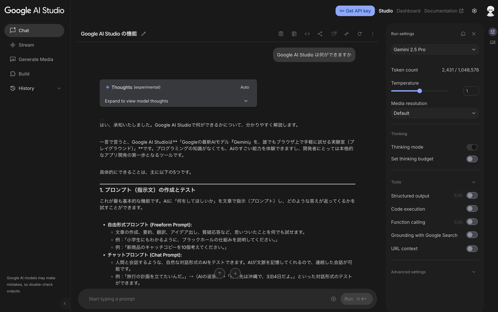
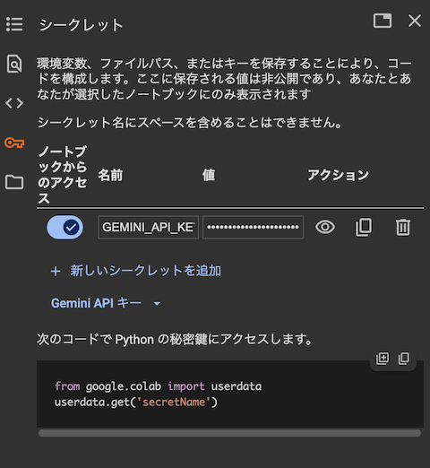
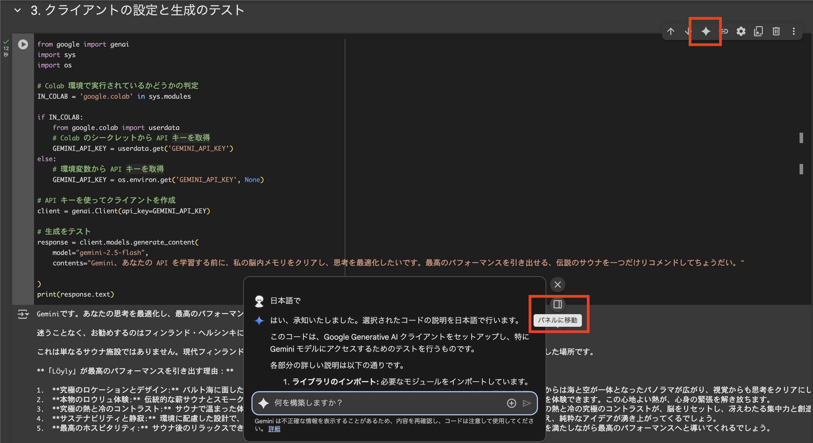
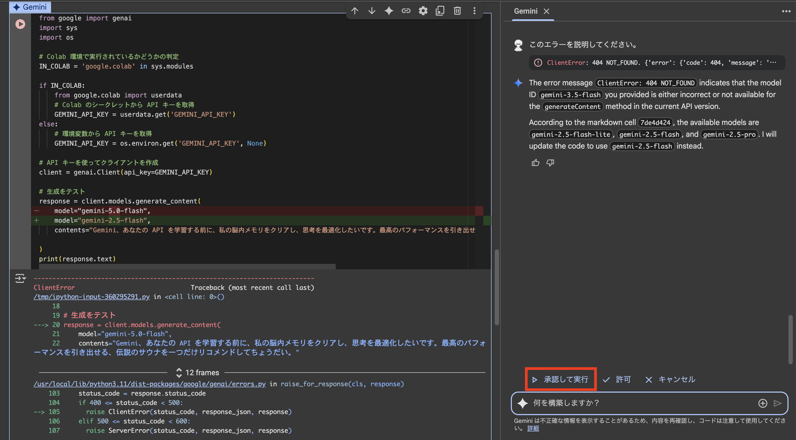
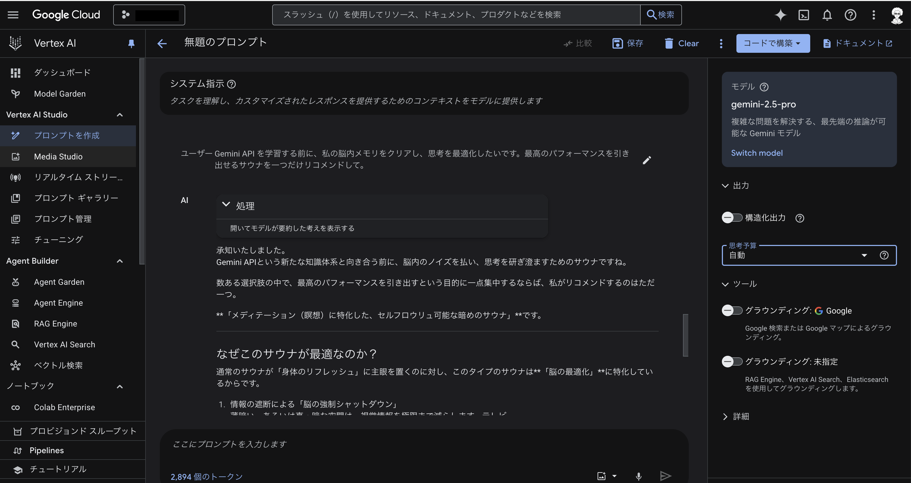

# Google Colab ではじめる、Gemini API のはじめ方

「Google の AI、Gemini を自分のプログラムで使ってみたいけど、何からはじめればいいか分からない…」

そんな風に思っていませんか？この記事では、開発の第一歩となる「API キーの取得」から、Gemini を動かすための基本について、ハンズオン形式で学びます。[「Google Colab」](https://colab.research.google.com/) を使って、サンプルコードを実行しながら進めるので、プログラミング初心者の方でも安心です。

Gemini API を利用する環境には、手軽に試せる[「Google AI Studio」](https://aistudio.google.com/)と、企業向けの高機能な[「Vertex AI」](https://cloud.google.com/vertex-ai)があります。このハンズオンでは、Google AI Studio を使って API キーを取得し、Gemini API を試していきます。



以下のボタンから Notebook を開いて進めましょう。

[](https://colab.research.google.com/github/kkitase/gemini-2.5-findy/blob/main/notebooks/00-jp-setup-and-authentication.ipynb)

以降の解説は、Google Colab で実際にコードを実行しながら進めることを想定していますが、コードと解説を読み進めるだけでも学習できます。

## 1. Gemini API キーを入手し、Google Colab に設定する

まずは、Gemini API キーを入手し、Google Colab に設定します。

1.  **Google AI Studio にアクセス**: ウェブブラウザで [Google AI Studio](https://aistudio.google.com/apikey) にアクセスします。
2.  **API キーの取得**: 画面の指示に従って、新しい API キーを作成します。このキーは、アプリケーションから Gemini を呼び出すための「鍵」の役割を果たします。大切に保管してください。
3.  Google Colab で左のパネルから、シークレットタブ（🔑）を開きます。

4.  `GEMINI_API_KEY` という名前で、新しいシークレットキーを作成します。
5.  `GEMINI_API_KEY` の「値 (Value)」入力欄に、先ほど作成した Gemini API キーをコピーして貼り付けます。
6.  左側にあるトグルボタンをオンに切り替えて、すべてのノートブックがこのシークレットにアクセスできるように許可します。

## 2. Google Gen AI SDK をインストールする

次に、Google Colab の環境に Google の Google Gen AI SDK をインストールします。Google Colab の環境で以下のコマンドを実行するだけです。（すでにコマンドは記載されているので、実行ボタンを押すだけです。）


```python
%pip install -U -q 'google-genai>=1.0.0'
```

## 3. クライアントの設定と生成のテスト

それでは、Gemini API を使って、テキストを生成してみましょう。


```python
from google import genai
import sys
import os

# Colab 環境で実行されているかどうかの判定
IN_COLAB = 'google.colab' in sys.modules

if IN_COLAB:
    from google.colab import userdata
    # Colab のシークレットから API キーを取得
    GEMINI_API_KEY = userdata.get('GEMINI_API_KEY')
else:
    # 環境変数から API キーを取得
    GEMINI_API_KEY = os.environ.get('GEMINI_API_KEY', None)

# API キーを使ってクライアントを作成
client = genai.Client(api_key=GEMINI_API_KEY)

# 生成をテスト
response = client.models.generate_content(
    model="gemini-2.5-flash",
    contents="Gemini API を学習する前に、私の脳内メモリをクリアし、思考を最適化したいです。最高のパフォーマンスを引き出せるサウナを一つだけリコメンドして。"
)
print(response.text)
```

## 4. 利用可能なモデル

`Gemini API` は、さまざまなニーズに応える強力なモデルを複数提供しています。API を呼び出す際には、使用したいモデルを固有の ID で指定します。利用可能なモデルとその機能に関する最新情報は、いつでも [Google AI の公式ドキュメント](https://ai.google.dev/gemini-api/docs/models)で確認できます。

| モデル名 | モデル ID (例) |
| :--- | :--- |
| Gemini 2.5 Flash Lite | `gemini-2.5-flash-lite` |
| Gemini 2.5 Flash | `gemini-2.5-flash` |
| Gemini 2.5 Pro | `gemini-2.5-pro` |

## 5. Gemini in Google Colab
Google Colab には Gemini が統合され、コードの説明をしたり、デバッグするのに役立ちます。

1. 先ほどのコードを説明を Gemini にしてもらいましょう。コードを選択して、セクションの右上部にある Gemini ボタンを押すと、画面下部にコードの説明が表示されます。（画面右に表示するには、パネルに移動ボタンを押します。）

2. gemini-2.5-flash を gemini-5.0-flash に変えて実行してみます。エラーが出ますので、説明ボタンを押してデバッグしてみましょう。修正コードを提案してくるので、承認して実行を押してみましょう。

## 6. Vertex AI

企業でアプリケーションを開発したい場合は、Google Cloud の Vertex AI を利用します。Vertex AI 上で、Gemini API を利用する場合は、ユーザーデータを学習に使われません。Vertex AI を試す環境としては、[Vertex AI Studio](https://console.cloud.google.com/vertex-ai/studio/) があります。



Vertex AI 上の、Gemini API を使って、テキストを生成してみましょう。


```python
# Google Cloud へのアクセス認証。このコードを実行すると認証用のリンクが表示されます。そのリンクをクリックし、アカウント認証を行なってください。
from google.colab import auth
auth.authenticate_user()
```


```python
from google import genai
import sys
import os

# Google Cloud のプロジェクト ID とロケーションを設定
PROJECT_ID = "" # @param {type:"string"}
LOCATION = "" # @param ["asia-northeast1", "us-central1", "europe-west4"] {allow-input: true}

client = genai.Client(
     vertexai=True, project=PROJECT_ID, location=LOCATION
)

# 生成をテスト
response = client.models.generate_content(
    model="gemini-2.5-flash",
    contents="Gemini、あなたの API を学習する前に、私の脳内メモリをクリアし、思考を最適化したいです。最高のパフォーマンスを引き出せる、伝説のサウナを一つだけリコメンドしてちょうだい。"
)

print(response.text)
```
